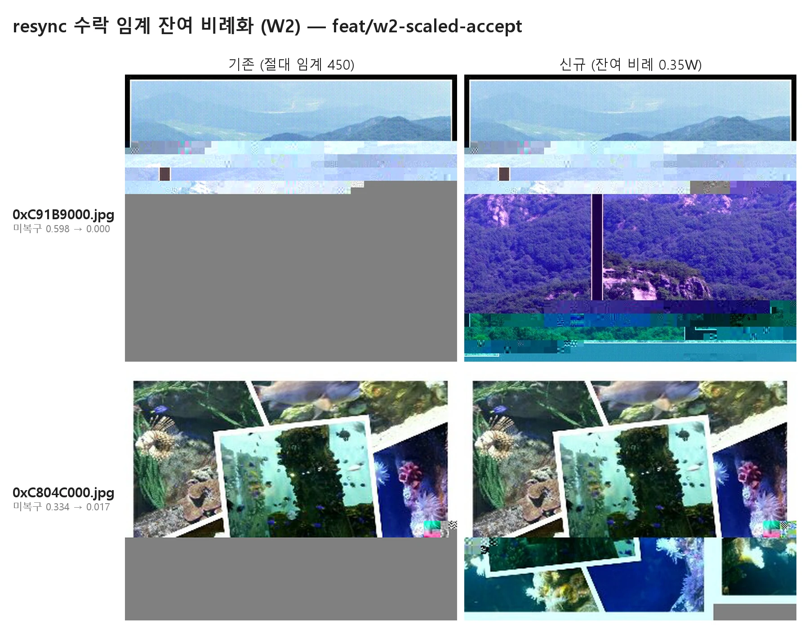

# 보고서 — 수락 임계 비례화: 복구 실패 66개 중 51개 복구 전환, 악화 0

- **날짜:** 2026-07-03
- **대상/범위:** 추출 JPEG 822개 전수 — 기존 엔진(W1, `output/jpeg_recovered_w1/`) vs 수락 임계 비례화(W2, `output/jpeg_recovered_w2/`), 동일 입력·동일 조건(`--time-budget 0`)
- **한 줄 요약:** 복구 시도가 전혀 통하지 않던 파일(FAILED) 66개 중 51개가 복구(RECOVERED)로 전환됐고, 기존에 복구되던 파일은 단 하나도 나빠지지 않았다(악화 0).
- **관련 문서:** [ADR 0005](../adr/0005-scaled-accept-threshold.md)(결정·근거), [W2 조사 기록](../investigations/2026-07-03-w2-scaled-accept-dc-scoring.md)(실험 과정), [recover 스펙](../specs/0002-recover.md)(동작)

---

## 1. 한눈에 보기

작은 사진과 손상이 촘촘한 사진은 기존 엔진의 복구 승인 문턱(고정값)이 구조적으로 넘을 수
없는 높이여서, 손상 지점 이후가 전부 회색으로 남았다. 문턱을 "남은 영역 크기에 비례"하도록
바꾸자 **복구 실패 파일 66개 중 51개가 복구로 전환**됐고(위 그림처럼 손상 지점 이후 전량
회색이던 영역이 콘텐츠로 복원), **기존에 복구되던 파일의 악화는 0건**이다. 복원된 영역의
색 틀어짐·가로 밀림은 다음 단계(W4·W5)에서 다루는 별도 결함이다.

| 지표 | 기존(W1) | 신규(W2) | 의미 |
|------|---------|---------|------|
| 복구 성공(RECOVERED) | 487개 | **539개** | 내용이 일부라도 복원돼 저장된 파일 |
| 복구 실패(FAILED) | 66개 | **15개** | 복구 시도가 전혀 승인되지 않은 파일 |
| 파일별 악화 | — | **0건** | 이번 변경으로 나빠진 파일이 없다 |
| 미복구 회색 총량(합) | 47.38 | **24.05** | 복구·실패 파일 전체의 회색 비율 합 — 절반으로 감소 |

## 2. 배경·목적

복구 엔진은 손상 지점을 만나면 "이 지점부터 다시 읽으면 얼마나 매끄럽게 이어지는가"를
측정해, 충분히 길게 이어질 때만 복구를 승인한다. 기존 승인 문턱은 **고정값 450 MCU**
(MCU = JPEG의 최소 블록 단위, 대략 8~16픽셀 타일)였다. 그래서:

- 전체가 450 MCU보다 작은 **작은 사진**은 어떤 복구도 승인될 수 없었고,
- 큰 사진이라도 **손상이 450 MCU 간격보다 촘촘하면** 같은 이유로 잠겼다.

이 파일들은 손상 지점 이후 전체가 회색으로 남은 채 FAILED로 분류됐다(66개). 이번 작업(W2)은
문턱을 남은 영역 크기(W)에 비례한 값 `max(30, 0.35×W)`로 바꾸고, 데이터가 파일 끝까지
이어지는 경우(잘린 파일)의 예외 승인을 추가했다. 근거와 안전성 검증은
[ADR 0005](../adr/0005-scaled-accept-threshold.md) 참조.

## 3. 방법

- **입력**: `output/jpeg/` 822개(동일 입력), 시간 제한 없음(`--time-budget 0`) — 두 실행의
  비교 조건 동일.
- **지표**: 미복구 비율(undec) = 디코더가 채우지 못해 회색으로 남은 픽셀의 비율(0~1).
  파일별로 기존↔신규를 대조해 +0.01 초과 증가를 "악화"로 판정.
- **안전 검증**: 고정 샘플 14개(실패 8 + 기존 정상 6)로 실험 루프를 돌린 뒤 본체에 이식,
  샘플 재검증(14/14 일치), 전수 실행 후 파일별 대조. 새로 복구된 51개 중 12개 표본을
  육안 확인(가짜 복구 여부).

## 4. 결과

**분류 이동** (822개 전수, 그 외 이동 없음):

| 이동 | 파일 수 | 의미 |
|------|--------|------|
| FAILED → RECOVERED | **51** | 전량 회색으로 남던 파일이 콘텐츠 복원으로 전환 |
| CLEAN → RECOVERED | 1 | 정상으로 분류되던 파일의 미세 손상 1바이트까지 수정돼 완전 복구(회색 0.195→0.000) |
| 유지 | 770 | RECOVERED 487·CLEAN 142·FAILED 15·SKIP 126 |

**미복구 회색 감소** (복구·실패 파일의 undec 평균, 사진 크기 대역별):

| 사진 크기(MCU) | 기존 | 신규 | 해석 |
|---------------|------|------|------|
| 120–449 (작은 사진) | 0.121 | **0.018** | 잠금 해소의 주 수혜 대역 — 회색이 1/6로 |
| 450–899 (중간) | 0.176 | **0.046** | 촘촘한 손상 파일의 잠금 해소 |
| ≥900 (큰 사진) | 0.044 | 0.041 | 대형은 기존에도 대부분 복구됨 — 소폭 개선 |
| <120 (초소형) | 0.155 | 0.155 | 변화 없음 — 이 대역의 실패 원인은 문턱이 아니라 **헤더 손상**(다음 단계 W3의 대상) |

- **악화 0 / 개선 65** — 파일 단위 대조에서 나빠진 파일이 없다. 문턱을 낮췄지만 가짜
  복구(회색을 쓰레기로 채움)가 유입되지 않았다는 뜻이며, 육안 표본 12개에서도 가짜 복구는
  0건이었다(전부 실제 콘텐츠).
- **남은 FAILED 15개** = 헤더 손상·초소형 11(엔진이 아니라 파일 머리말이 깨진 경우 —
  W3에서 이식 복구 예정) + 사실상 정상 1(회색 0.4%) + 파일이 중간에서 잘려 데이터 자체가
  없는 절단 3.
- 전수 실행 시간 17.6분(822개, 12 프로세스 병렬) — 운영 비용 변화 없음.

## 5. 결론·권고

1. 고정 문턱이 만들던 "작은 사진·촘촘한 손상 = 복구 불가"가 해소됐다. 복구 성공 파일이
   487→539개로 늘었고 악화가 없으므로 **W2 결과물(`output/jpeg_recovered_w2/`)을 현행
   산출물로 사용**할 것을 권고한다.
2. 다음 병목은 명확하다 — 남은 실패의 대부분(11/15)은 **헤더 손상**이며, 백로그
   W3(헤더 복구 pass)가 직접 대상이다.
3. 복원된 영역의 **색 틀어짐·가로 밀림**은 이번 작업 범위 밖의 기지 결함으로(위 그림
   신규 열에서도 보임), 백로그 W4(밀림)·W5(색 보정)가 다룬다.

## 6. 한계

- 미복구 비율(undec)은 "회색으로 남았는가"만 재고 **복원 내용의 정확성(색·위치)은 재지
  않는다** — 색 캐스트·밀림이 있어도 수치는 좋게 나온다. 내용 검증은 육안 표본(12개)으로
  보완했다.
- 낮아진 문턱(최소 30 MCU)으로 승인된 짧은 구간은 450 시절보다 검증 신호가 약하다.
  이번 전수·표본에서 가짜 복구는 관찰되지 않았지만, 새 데이터에서 재발 시
  파일별 대조 + 육안 표본 절차로 재검한다(ADR 0005 향후 고려사항).
- 비교는 이 코퍼스(단일 디스크 이미지에서 추출한 822개) 한정이다.

## 7. 부록 — 수치 출처

| 수치 | 출처 |
|------|------|
| 분류 건수·이동(487→539, 66→15, 51, 1) | `output/jpeg_recovered_w1/report.csv` ↔ `output/jpeg_recovered_w2/report.csv` 전수 대조(비교 스크립트) |
| 악화 0·개선 65 | 위 대조에서 파일별 undec_after 차 ±0.01 기준 집계 |
| undec 합 47.38→24.05, 대역별 평균 | 위 대조(RECOVERED+FAILED, W1 553개·W2 554개) |
| 실행 시간 17.6분 | 전수 실행 로그(진행바 17:35) |
| 그림 캡션 0.598→0.000, 0.334→0.017 | 두 report.csv의 해당 파일(0xC91B9000·0xC804C000) undec_after — before 렌더에서 재측정 일치 |
| 대표 그림 | `tools/montage.py` — before는 손상 지점 정지 렌더, after는 W2 산출물, 블러 없음(인물 미포함 표본) |

비교 스크립트·전수 로그는 세션 스크래치패드(임시)에서 실행 — 수치는 report.csv 2개로 재현
가능하다. 실험 과정 전체는 [W2 조사 기록](../investigations/2026-07-03-w2-scaled-accept-dc-scoring.md).
